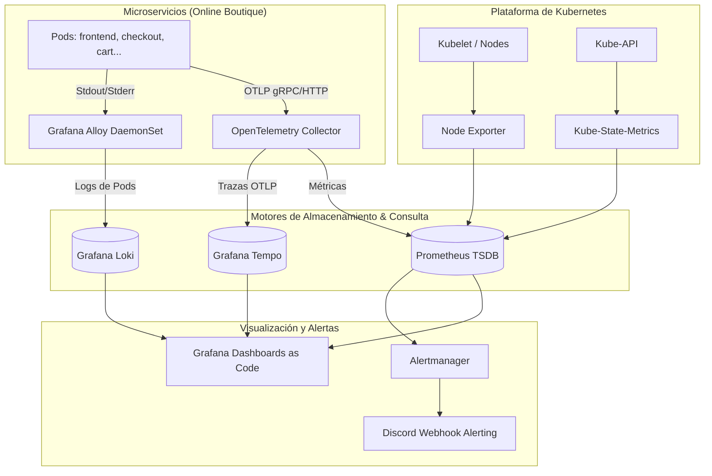

# 🔭 `observability-stack` — Observabilidad Integral como Código

[](https://github.com/miguelortiz13/observability-stack/actions/workflows/ci.yaml)
[](https://prometheus.io/)
[](https://grafana.com/)
[](https://opentelemetry.io/)
[](https://github.com/yannh/kubeconform)

Repositorio del **Proyecto 4 (`observability-stack`)** del **Laboratorio Integral de DevOps & SRE**. Implementa los **tres pilares de la observabilidad** (métricas, logs y trazas distribuidas) para el sistema de microservicios **Google Online Boutique**, correlacionados en **Grafana**, con dashboards y alertas declarativas como código.

---

## 🎯 1. Qué Problema Resuelve

En una arquitectura de microservicios distribuida:
1. **Puntos Ciegos:** Un error HTTP 500 en el frontend no revela cuál de los servicios dependientes (`cartservice`, `paymentservice`, `currencyservice`) causó la falla ni por qué.
2. **Alertas Ruidosas o Tardías:** Las alertas tradicionales basadas en consumo bruto de CPU o memoria no indican si los usuarios reales sufren errores o degradación de latencia.
3. **Pérdida de Contexto:** Sin correlación cruzada entre métricas, trazas y logs, el tiempo medio de resolución (MTTR) escala a horas.

`observability-stack` unifica la telemetría en Kubernetes mediante estándares abiertos (OpenTelemetry, PromQL, LogQL, Tempo) garantizando que **desde una alerta se llegue al dashboard, de ahí a la traza lenta y directamente a sus logs**.

---

## 🏛️ 2. Arquitectura de Observabilidad de Extremo a Extremo



---

## 📦 3. Componentes del Stack

| Componente | Rol en la Plataforma | Configuración y Despliegue |
|---|---|---|
| **`kube-prometheus-stack`** | Prometheus Operator, Prometheus TSDB, Alertmanager, Node Exporter, Kube-State-Metrics y Grafana. | Helm chart `prometheus-community/kube-prometheus-stack` v92.1.1 gestionado vía Argo CD. |
| **`Grafana`** | Tableros unificados con soporte de provisioning declarativo para dashboards (métodos RED y USE) y datasources. | Integrado con **External Secrets Operator** para autenticación `admin` desde Azure Key Vault. |
| **`Loki` & `Alloy`** | Ingesta y consulta de logs estructurados con retención eficiente sin indexación pesada de texto completo. | Single-binary / filesystem en dev con Grafana Alloy DaemonSet (P4-02). |
| **`Tempo` & `OTel Collector`** | Almacenamiento de trazas distribuidas e ingesta unificada de instrumentación OTLP (gRPC/HTTP). | Tempo Single-binary y OTel Collector Gateway con spans correlacionados (P4-03). |

---

## 🔐 4. Seguridad y Gestión de Secretos (Integración P3-05)

Siguiendo el estándar de seguridad establecido en **P3-05**, las credenciales de administración de Grafana no se almacenan en texto plano en Git ni en valores estáticos:
* El secreto `grafana-admin-credentials` se sincroniza dinámicamente desde **Azure Key Vault** (`grafana-admin-user`, `grafana-admin-password`) mediante el `ClusterSecretStore` `azure-keyvault` con **Azure Workload Identity**.
* El chart de Grafana consume directamente el secreto mediante `grafana.admin.existingSecret: grafana-admin-credentials`.

---

## 📊 5. Guías de Telemetría y Consultas

* 📄 [**`docs/promql.md` — 10 Consultas PromQL Esenciales (USE, RED y Burn Rate)**](docs/promql.md)
* 📄 [**`docs/logql.md` — Consultas de Logs con LogQL para Microservicios**](docs/logql.md)
* 📄 [**`docs/tracing.md` — Guía de Trazabilidad Distribuida: OpenTelemetry, Tempo & TraceQL**](docs/tracing.md)
* 📄 [**`docs/dashboards.md` — Dashboards como Código: Métodos RED y USE en Grafana**](docs/dashboards.md)

---


## 🛠️ 6. Validación Local y Automatización

El repositorio incluye un `Makefile` para validar los templates y esquemas OpenAPI offline:

```bash
# Mostrar menú de comandos disponibles
make help

# Validar sintaxis y compilación del chart
make lint

# Validar contra los esquemas OpenAPI oficiales de Kubernetes con Kubeconform
make validate
```
