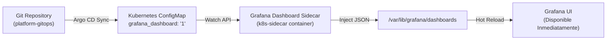

# Dashboards como Código: Métodos RED y USE en Grafana

Este documento describe la metodología, arquitectura técnica y catálogo de consultas para los tableros de visualización implementados como código (Dashboards-as-Code) en **Grafana** mediante el sidecar de aprovisionamiento declarativo de Kubernetes.

---

## 1. Filosofía de Diseño: Por qué RED y USE

En Site Reliability Engineering (SRE), saturar a los operadores con decenas de gráficos desconectados incrementa la fatiga de alertas y el MTTR. Para evitarlo, adoptamos dos estándares reconocidos por la industria:

| Método | Ámbito de Aplicación | Pregunta Fundamental | Enfoque |
|---|---|---|---|
| **RED Method** | Microservicios y Aplicaciones (orientado a peticiones) | *¿Están los usuarios experimentando fallos o lentitud?* | **R**ate, **E**rrors, **D**uration |
| **USE Method** | Infraestructura y Recursos (Hardware, VM, Nodos, Pods) | *¿Está algún componente de cómputo saturado o agotándose?* | **U**tilization, **S**aturation, **E**rrors |

---

## 2. Dashboard 1: Microservicios Online Boutique (`online-boutique-red`)

* **Ubicación:** `dashboards/services-red.json`
* **UID:** `online-boutique-red`
* **Variables Dinámicas:**
  * `$service`: Consulta dinámica `label_values(container_cpu_usage_seconds_total{namespace="$namespace", container!~"POD|"}, container)` que autodescubre todos los microservicios (`frontend`, `checkoutservice`, `cartservice`, `paymentservice`, etc.) con opción multicontenedor o individual.
  * `$interval`: Ventana temporal para la función `rate()` (`1m`, `5m`, `15m`, `1h`).

### Métricas y Paneles del Método RED

#### 1. Rate (Tasa de Solicitudes)
* **Panel Stat:** Rendimiento global actual en peticiones por segundo.
* **Panel TimeSeries:** Tráfico por servicio en el tiempo.
* **PromQL:**
  ```promql
  sum by (container) (rate(container_cpu_usage_seconds_total{namespace="$namespace", container=~"$service"}[$interval]))
  ```

#### 2. Errors (Tasa de Fallos)
* **Panel Stat:** Porcentaje de errores HTTP 5xx / llamadas gRPC fallidas respecto al total.
* **Panel TimeSeries:** Errores absolutos por segundo con umbrales visuales (Verde < 1%, Amarillo 1-5%, Rojo > 5%).
* **PromQL:**
  ```promql
  (sum(rate(http_requests_total{status=~"5.*", job=~"$service.*"}[$interval])) or vector(0)) 
  / 
  (sum(rate(http_requests_total{job=~"$service.*"}[$interval])) or vector(1)) * 100
  ```

#### 3. Duration (Latencia y Tiempo de Respuesta)
* **Panel Stat:** Latencia del percentil 95 (p95 SLA/SLO).
* **Panel TimeSeries:** Desglose comparativo de percentiles p50 (mediana), p90, p95 y p99.
* **PromQL:**
  ```promql
  histogram_quantile(0.95, sum(rate(http_request_duration_seconds_bucket{job=~"$service.*"}[$interval])) by (le))
  ```

#### 4. Saturación y Estabilidad de Pods
* **Paneles TimeSeries:**
  * Uso de CPU en cores por contenedor vs Request/Limit.
  * Memoria Working Set por contenedor vs Limit.
  * Tasa de reinicios de contenedores (`kube_pod_container_status_restarts_total`) y transiciones de estado de Pods.

---

## 3. Dashboard 2: Nodos de Kubernetes (`k8s-nodes-use`)

* **Ubicación:** `dashboards/nodes-use.json`
* **UID:** `k8s-nodes-use`
* **Variables Dinámicas:**
  * `$node`: Consulta dinámica `label_values(node_uname_info, instance)` filtrando por nodo individual o clúster completo.

### Métricas y Paneles del Método USE

#### 1. CPU
* **Utilization (%):** Tiempo que la CPU dedica a tareas útiles (no idle).
  ```promql
  100 - (avg by (instance) (rate(node_cpu_seconds_total{mode="idle", instance=~"$node"}[$interval])) * 100)
  ```
* **Saturation (Load Average 1m / Cores):** Número de hilos esperando turno de CPU normalizado por el total de núcleos. Valores > 1.0 indican cola y saturación.
  ```promql
  node_load1{instance=~"$node"} / count without (cpu, mode) (node_cpu_seconds_total{mode="idle", instance=~"$node"})
  ```
* **Desglose de Modos:** TimeSeries apilado comparando tiempo en `user`, `system`, `iowait`, `softirq`.

#### 2. Memoria
* **Utilization (%):** Memoria RAM física consumida respecto al total.
  ```promql
  (1 - (node_memory_MemAvailable_bytes{instance=~"$node"} / node_memory_MemTotal_bytes{instance=~"$node"})) * 100
  ```
* **Saturation (Major Page Faults):** Fallos de página que requieren lectura directa de disco, señal temprana de presión extrema de memoria antes del OOMKilled.
  ```promql
  rate(node_vmstat_pgmajfault{instance=~"$node"}[$interval])
  ```
* **Desglose de Memoria:** TimeSeries separando Memoria Usada, Buffers, Caché del kernel y Libre.

#### 3. Almacenamiento / Filesystem
* **Utilization (%):** Porcentaje de espacio en disco consumido en `/`.
  ```promql
  (1 - (node_filesystem_avail_bytes{mountpoint="/", instance=~"$node"} / node_filesystem_size_bytes{mountpoint="/", instance=~"$node"})) * 100
  ```
* **Throughput I/O:** Bytes leídos y escritos por segundo (`node_disk_read_bytes_total`, `node_disk_written_bytes_total`).
* **Saturation (I/O Wait / Queue Time):** Tiempo que los procesos pasan bloqueados esperando acceso a disco (`node_disk_io_time_seconds_total`).

#### 4. Red (Network)
* **Utilization:** Ancho de banda entrante (Rx) y saliente (Tx) en bits por segundo.
  ```promql
  sum by (device) (rate(node_network_receive_bytes_total{instance=~"$node", device!~"lo|veth.*|docker.*"}[$interval])) * 8
  ```
* **Saturation (Packet Drops):** Paquetes descartados por buffers de red saturados.
  ```promql
  sum(rate(node_network_receive_drop_total{instance=~"$node"}[$interval])) + sum(rate(node_network_transmit_drop_total{instance=~"$node"}[$interval]))
  ```
* **Errors:** Paquetes de red con errores de transmisión o checksum.
  ```promql
  sum(rate(node_network_receive_errs_total{instance=~"$node"}[$interval])) + sum(rate(node_network_transmit_errs_total{instance=~"$node"}[$interval]))
  ```

---

## 4. Provisioning Declarativo como Código (Sidecar Pattern)

Los tableros se despliegan en el clúster a través de **GitOps** (`platform-gitops`) empaquetados en `ConfigMaps` de Kubernetes:



### Garantía de Resiliencia:
Si el Pod de Grafana o su StatefulSet es eliminado, reiniciado o recreado desde cero:
1. El contenedor sidecar arranca automáticamente y consulta la API de Kubernetes buscando ConfigMaps con la etiqueta `grafana_dashboard: "1"`.
2. Escribe los archivos JSON en el volumen efímero de Grafana.
3. Grafana detecta los archivos e importa los tableros instantáneamente sin requerir intervención humana ni respaldos manuales de base de datos.
