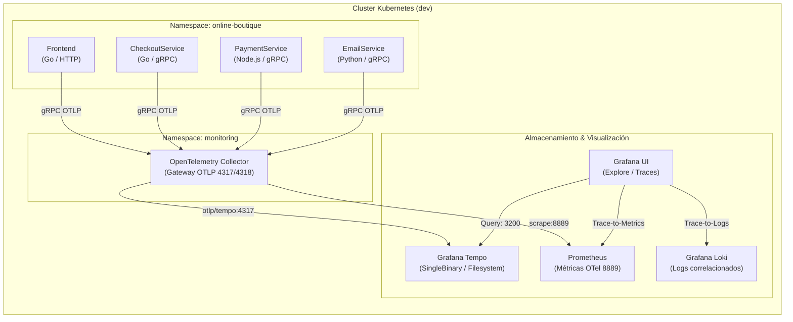

# Guía Práctica de Trazabilidad Distribuida: OpenTelemetry & Grafana Tempo

Esta guía documenta la arquitectura de instrumentación distribuida, recolección y análisis de trazas (distributed tracing) para el entorno **DevOps & SRE Lab**, utilizando **OpenTelemetry Collector**, **Grafana Tempo**, y el microservicio de demostración **Online Boutique**.

---

## 1. Fundamentos de Distributed Tracing

En arquitecturas basadas en microservicios, una única solicitud de usuario (como ejecutar un checkout o añadir un producto a la cesta) atraviesa múltiples servicios independientes a través de llamadas de red (HTTP, gRPC). Cuando se produce latencia anómala o fallos intermitentes, los logs individuales y las métricas agregadas son insuficientes para identificar el cuello de botella exacto.

### Conceptos Clave
* **Trace (Traza):** Representa el recorrido de extremo a extremo de una transacción a través de la red de microservicios. Se identifica unívocamente mediante un `TraceID` hexadecimal de 16 bytes (32 caracteres).
* **Span:** La unidad fundamental de trabajo en una traza. Contiene nombre de operación, timestamps de inicio y fin, estado (`OK`, `Error`), atributos (`http.status_code`, `rpc.method`, `db.statement`), eventos temporales y enlaces.
* **Context Propagation (Propagación de Contexto):** Mecanismo para transferir identificadores de traza y metadatos entre microservicios. Sigue el estándar **W3C Trace Context**:
  * Cabecera `traceparent`: `00-4bf92f3577b34da6a3ce929d0e0e4736-00f067aa0ba902b7-01`
    * `00`: Versión del estándar.
    * `4bf92f3577b34da6a3ce929d0e0e4736`: `TraceID`.
    * `00f067aa0ba902b7`: `ParentSpanID`.
    * `01`: `TraceFlags` (bit 1 activado indica que la traza fue muestreada).

---

## 2. Arquitectura del Pipeline de Trazas



### Componentes y Roles
1. **Microservicios Online Boutique:** Emiten spans instrumentados nativamente mediante el SDK de OpenTelemetry al recibir `COLLECTOR_SERVICE_ADDR: "opentelemetry-collector.monitoring.svc:4317"` y `ENABLE_TRACING: "1"`.
2. **OpenTelemetry Collector (Deployment):**
   * **Receivers:** Expone `otlp` (gRPC en puerto 4317 y HTTP en puerto 4318).
   * **Processors:** `memory_limiter` (evita OOMKilled limitando la memoria al 80%) y `batch` (agrupa spans por lotes de 256 o 1s para optimizar la red).
   * **Exporters:**
     * `otlp/tempo`: Envía trazas por gRPC a `tempo.monitoring.svc.cluster.local:4317`.
     * `prometheus`: Expone métricas recolectadas en el puerto 8889.
     * `debug`: Imprime resúmenes de spans en stdout para diagnóstico local.
3. **Grafana Tempo (StatefulSet / SingleBinary):** Almacena bloques de trazas en disco local con 24 horas de retención y expone endpoint de consulta en puerto 3200.

---

## 3. Análisis de una Traza de Checkout (`/cart/checkout`)

El flujo de checkout es el más crítico de la tienda y abarca 7 microservicios en cascada:

```
[TraceID: a4b1c2d3e4f5061728394a5b6c7d8e9f] - Duración total: 185ms
│
├── [frontend] HTTP POST /cart/checkout (185ms)
│   │
│   ├── [checkoutservice] rpc hipstershop.CheckoutService/PlaceOrder (172ms)
│   │   ├── [cartservice] rpc hipstershop.CartService/GetCart (12ms)
│   │   ├── [productcatalogservice] rpc hipstershop.ProductCatalogService/GetProduct (18ms)
│   │   ├── [currencyservice] rpc hipstershop.CurrencyService/Convert (15ms)
│   │   ├── [shippingservice] rpc hipstershop.ShippingService/GetQuote (22ms)
│   │   ├── [paymentservice] rpc hipstershop.PaymentService/Charge (65ms)
│   │   │   └── [internal] validateCardNumber & authorize (60ms)
│   │   ├── [shippingservice] rpc hipstershop.ShippingService/ShipOrder (25ms)
│   │   ├── [cartservice] rpc hipstershop.CartService/EmptyCart (8ms)
│   │   └── [emailservice] rpc hipstershop.EmailService/SendOrderConfirmation (7ms)
```

### Detección de Cuellos de Botella y Errores
1. **Análisis de Latencia Crítica:** En el ejemplo anterior, `PaymentService/Charge` consume el **35% de la latencia total** (65ms de 185ms). Esto ayuda a enfocar las optimizaciones de rendimiento en la pasarela de pagos.
2. **Propagación de Errores (Error Spans):** Si un servicio secundario (por ejemplo, `emailservice`) falla, el span se marca con `status.code = ERROR` y el evento `exception` registra el stacktrace. Al analizar la traza, se puede confirmar si el fallo abortó la orden o si se manejó de manera asíncrona no bloqueante.

---

## 4. Consultas en Grafana Explore con Tempo

### Búsqueda por Servicio y Operación (Search)
1. En Grafana, abrir **Explore** y seleccionar el datasource **Tempo**.
2. Configurar los filtros de búsqueda:
   * **Service Name:** `checkoutservice`
   * **Span Name:** `hipstershop.CheckoutService/PlaceOrder`
   * **Min Duration:** `100ms`
   * **Status:** `error` (o `all`)
3. Pulsar **Run query** para visualizar la lista de trazas coincidentes con su duración y timestamp.

### Búsqueda por TraceQL (Tempo Query Language)
Tempo soporta **TraceQL**, un lenguaje declarativo para filtrar trazas con precisión milimétrica:

#### 1. Buscar todas las órdenes de checkout con latencia superior a 200ms:
```traceql
{ span.http.target = "/cart/checkout" && duration > 200ms }
```

#### 2. Localizar trazas donde algún microservicio haya devuelto error:
```traceql
{ status = error }
```

#### 3. Identificar llamadas donde el servicio de pagos haya tardado más de 100ms:
```traceql
{ resource.service.name = "paymentservice" && duration > 100ms }
```

#### 4. Correlacionar checkout fallidos causados específicamente por paymentservice:
```traceql
{ resource.service.name = "checkoutservice" } && { resource.service.name = "paymentservice" && status = error }
```

---

## 5. Correlación Tridimensional: Trazas, Logs y Métricas

La integración aprovisionada en `platform-gitops` vincula los 3 pilares de observabilidad:

1. **Trace to Logs (Tempo ➔ Loki):**
   * Al hacer clic en un span en Grafana Tempo, aparece el botón **Logs for this span**.
   * Abre automáticamente Grafana Loki ejecutando `{app=~"checkoutservice"} |= "<trace_id>"`, mostrando únicamente las líneas de log emitidas durante la ejecución exacta de ese span.
2. **Trace to Metrics (Tempo ➔ Prometheus):**
   * Tempo vincula automáticamente el nombre del servicio con las métricas de Prometheus (`http_request_duration_seconds_bucket`, `traces_spanmetrics_*`), permitiendo saltar a los gráficos de latencia p95 y tasa de peticiones del servicio en esa ventana de tiempo.
3. **Log to Trace (Loki ➔ Tempo):**
   * Mediante la directiva `derivedFields` configurada en el datasource de Loki, cualquier aparición de `trace_id` o `traceparent` en los logs se convierte en un hipervínculo interactivo que abre directamente la traza en Tempo.
